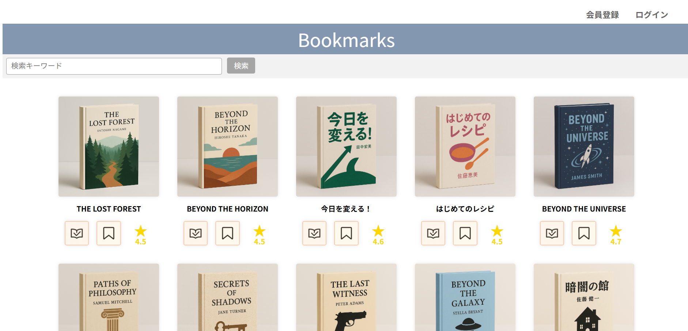
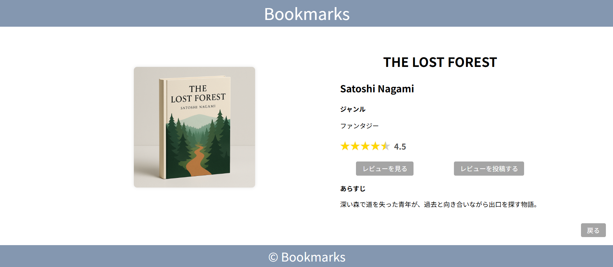
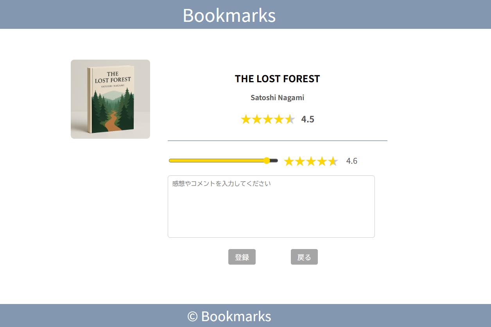
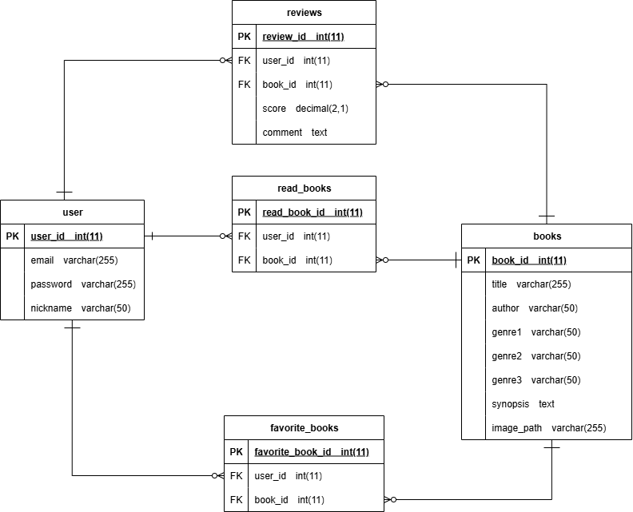

# 📚 Bookmarks

## 🌟 概要
**Bookmarks** は、読んだ本のレビューや評価を共有できるブックレビューアプリです。  
ユーザーが本の感想やおすすめを投稿し、他の人の意見を参考にできるよう設計されています。

## 🧩 使用技術
- **言語**：Java（Servlet / JSP）
- **フレームワーク**：JSTL
- **データベース**：MySQL
- **フロントエンド**：HTML / CSS
- **その他**：JDBC, DAO, MVCアーキテクチャ

## 🚀 主な機能
- ユーザー登録・ログイン / ログアウト  
- 本の一覧・詳細表示  
- レビュー投稿・一覧表示  
- 評価（★）機能  
- 読書済み / お気に入り管理機能  
- 成功画面による操作フィードバック  

## 🖼 画面構成（JSP）
```
WEB-INF/jsp/
├── common/
│ ├── header.jsp # ヘッダー共通部品
│ └── footer.jsp # フッター共通部品
├── top.jsp # トップページ
├── home.jsp # ホーム画面
├── login.jsp # ログイン画面
├── userRegister.jsp # 新規登録画面
├── registerSuccess.jsp # 登録完了画面
├── bookDetail.jsp # 書籍詳細ページ
├── reviewList.jsp # レビュー一覧
├── reviewPost.jsp # レビュー投稿画面
└── reviewSuccess.jsp # 投稿完了画面
```

### 💻 アプリ画面イメージ
| トップページ | 書籍詳細ページ | レビュー投稿画面 |
|:--:|:--:|:--:|
|  |  |  |

## 🗂 ディレクトリ構成
```
Bookmarks/
├── src/
│ ├── main/java/
│ │ ├── dao/
│ │ │ ├── BooksDAO.java # 書籍情報のDBアクセス処理
│ │ │ ├── DBManager.java # DB接続管理クラス
│ │ │ ├── FavoriteBooksDAO.java # お気に入り機能のDB処理
│ │ │ ├── ReadBooksDAO.java # 読書済みデータ管理
│ │ │ ├── ReviewsDAO.java # レビュー投稿・取得処理
│ │ │ └── UserDAO.java # ユーザー情報管理
│ │ ├── model/
│ │ │ ├── Book.java # 書籍モデル
│ │ │ ├── Login.java # ログイン情報モデル
│ │ │ ├── Review.java # レビューモデル
│ │ │ └── User.java # ユーザーモデル
│ │ ├── service/
│ │ │ ├── BookService.java # 書籍関連のビジネスロジック
│ │ │ ├── ReviewService.java # レビュー関連ロジック
│ │ │ └── UserService.java # ユーザー関連ロジック
│ │ └── servlet/
│ │ ├── BookDetailServlet.java # 書籍詳細ページ表示
│ │ ├── BookListServlet.java # 書籍一覧表示
│ │ ├── HomeServlet.java # ホーム画面制御
│ │ ├── LoginServlet.java # ログイン処理
│ │ ├── LogoutServlet.java # ログアウト処理
│ │ ├── ReviewServlet.java # レビュー投稿処理
│ │ └── UserRegisterServlet.java# 新規登録処理
│ └── main/webapp/
│ ├── css/style.css # スタイル定義
│ ├── images/
│ │ ├── books/ # 書籍画像
│ │ └── icon/ # アイコン画像
│ └── WEB-INF/
│ └── jsp/ # JSPビュー群
└── build/ # コンパイル済みクラス
```

## 💾 データベース構成

### 🗂 テーブル一覧
| テーブル名 | 役割 |
|-------------|------|
| `user` | ユーザー情報を管理（ニックネーム、メールアドレス、パスワードなど） |
| `books` | 書籍データ（タイトル・著者・ジャンル・あらすじ・画像パスなど） |
| `reviews` | レビュー情報（ユーザー・書籍・スコア・コメントなど） |
| `read_books` | 読了した本の管理（ユーザーIDと書籍IDの組み合わせ） |
| `favorite_books` | お気に入り登録情報（ユーザーIDと書籍IDの組み合わせ） |

### 🧩 ER 図


### 🧱 主なカラム構成
#### `user`
| カラム名 | 型 | 内容 |
|-----------|----|------|
| `user_id` | INT | 主キー、自動採番 |
| `nickname` | VARCHAR(50) | 表示名 |
| `email` | VARCHAR(255) | メールアドレス（ユニーク制約） |
| `password` | VARCHAR(255) | ハッシュ化されたパスワード |

#### `books`
| カラム名 | 型 | 内容 |
|-----------|----|------|
| `book_id` | INT | 主キー |
| `title` | VARCHAR(255) | 書籍タイトル |
| `author` | VARCHAR(50) | 著者名 |
| `genre1〜3` | VARCHAR(50) | 複数ジャンル分類 |
| `synopsis` | TEXT | あらすじ |
| `image_path` | VARCHAR(255) | 画像パス |

#### `reviews`
| カラム名 | 型 | 内容 |
|-----------|----|------|
| `review_id` | INT | 主キー |
| `user_id` | INT | ユーザーID（外部キー） |
| `book_id` | INT | 書籍ID（外部キー） |
| `score` | DECIMAL(2,1) | 評価スコア（例：4.5） |
| `comment` | TEXT | レビュー本文 |

#### `read_books`
| カラム名 | 型 | 内容 |
|-----------|----|------|
| `user_id` | INT | ユーザーID（外部キー） |
| `book_id` | INT | 書籍ID（外部キー） |
※ 複合主キーで1ユーザーにつき1冊を一意に管理  

#### `favorite_books`
| カラム名 | 型 | 内容 |
|-----------|----|------|
| `user_id` | INT | ユーザーID（外部キー） |
| `book_id` | INT | 書籍ID（外部キー） |
※ 複合主キーでお気に入り登録を一意に管理  

## 💡 今後の展望
- ネタバレ注意表示機能の追加  
- ユーザーフォロー機能の実装  
- 管理者画面の作成  
- レビューランキング機能の追加  

## 👤 作者

**Author:** hikaru-1059<br>
**Language:** Japanese / 日本語<br>
職業訓練校での個人開発作品として制作。<br>
今後も改善を続けながら機能を拡張予定です。

## 📝 ライセンス

本プロジェクトは学習・個人利用目的で自由に利用できます。<br>
商用利用の場合は作者への連絡を推奨します。

